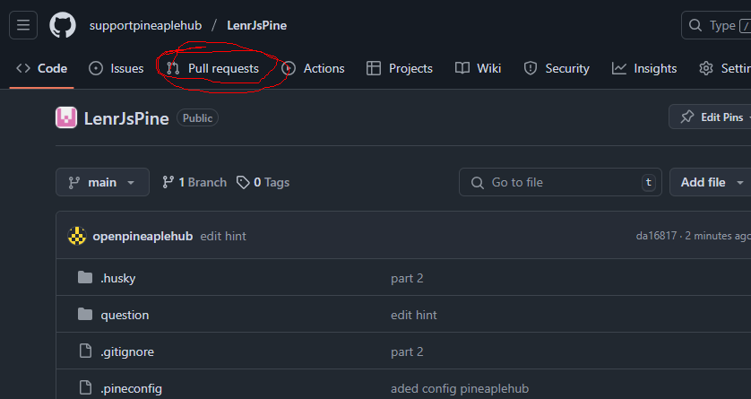
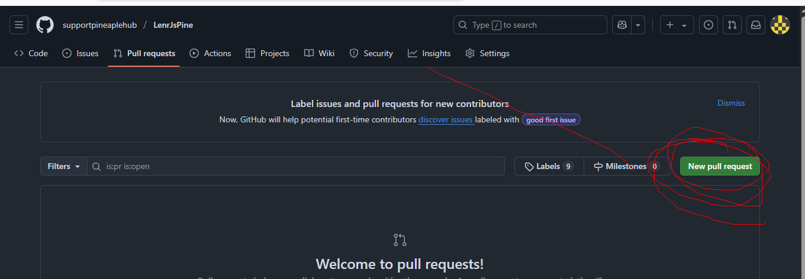
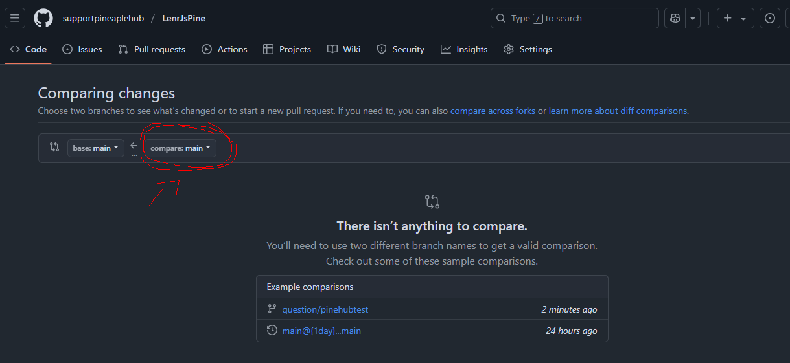
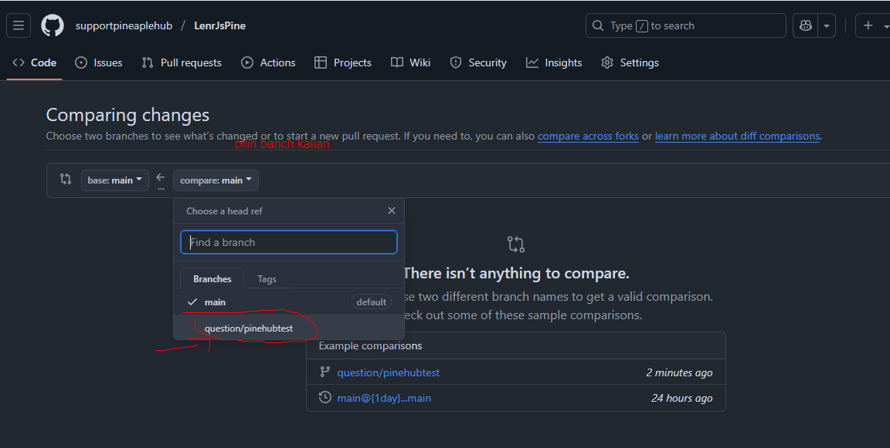
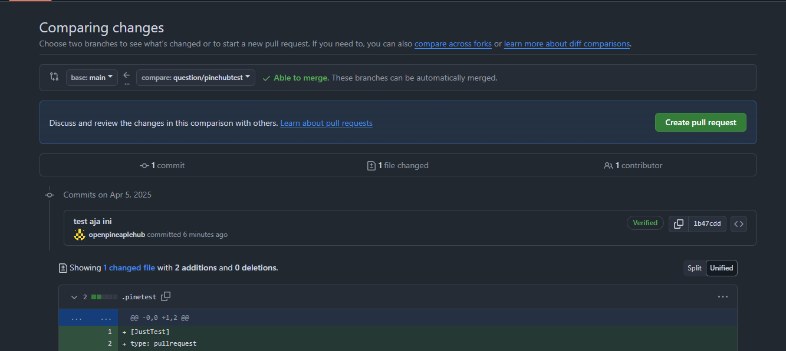

# Pertanyaan

Kalau lo ada pertanyaan soal materi atau ada bagian yang nggak ngerti dari penjelasan gue, lo bisa `pull repo` ini terus bikin `branch` kayak gini:

`quiz/{nick-lo}`

contoh

`quiz/pineaplehub`

owh ya lupa sebelum buat bracnh clone dulu
oke trus lu clone repo ini 

```sh
$ git clone https://github.com/supportpineaplehub/LenrJsPine.git
```

Abis itu, masuk ke folder `question` terus bikin file sama folder baru baru pake format:
```sh
mkdir -p question/pineaple #bisa gantu sama nama mu
touch question/pineaple/apa-itu-scope-min.txt
```

kalu udha masuk ke file txt yg di bikin dan tulis apa yg mau di tanyakan kalau bisa pakai struktyur ini 

```txt
Judul:

masalah:

kondisi lain (opsional):

harapan jawban admin:
```

---

Kalau lo udah bikin file `.txt` buat pertanyaan lo dan udah ngerasa bener, lanjut aja bikin PR (pull request).

Masuk ke terminal, terus jalanin step ini:

```sh
# Pertama, pastiin lo bikin branch baru dulu
$ git checkout -b quiz/pineaplehub # formatnya quiz/{nick-lo}

# Cek lagi lo udah di branch yang bener
$ git branch
# Harusnya muncul: quiz/pineaplehub

# Add file pertanyaan lo
$ git add question/pineaple/apa-itu-scope-min.txt

# Commit (isi pesan commitnya bebas, asal masih nyambung)
$ git commit -m "nanya soal scope, masih bingung logikanya"

# Push ke GitHub
$ git push origin quiz/pineaplehub # pakai branch kalian

# kalau yg g negti cara prs atau commit atau push ke yt aja dulu
```

## Pr
kalau udah di push kie github kalian ke bagian repo ini dan pergi ke [`Pull request`](https://github.com/supportpineaplehub/LenrJsPine/pulls)



kalau duha maisk kalian clik bagian [`new Pull Request`](https://github.com/supportpineaplehub/LenrJsPine/compare)



kalau udah kalian pilih lah nama brach kalia di bagian ini: 
ini contoh nya branch gua `question/pinehubtes` 
kalu udha kalian klik yg sbelah kiri atau yg `compare main`


kalau udha klain pilih branch kalian


trus nnti diaotomatis tampilan baru dan kalau n klik `create pull requetst` 


trsu kalian isi aja kayak bias anya sis aja asal sala jangana di assieng atau tanaga di sis yg sebelah kiri itu pun g apa apa trus kalian tekan push pull request 

dna nnti haisl nya gini 


Dan selamat udha siap nnti saya merge dan kita jawab di file yg kamu bikin jadi g bececer gitu 